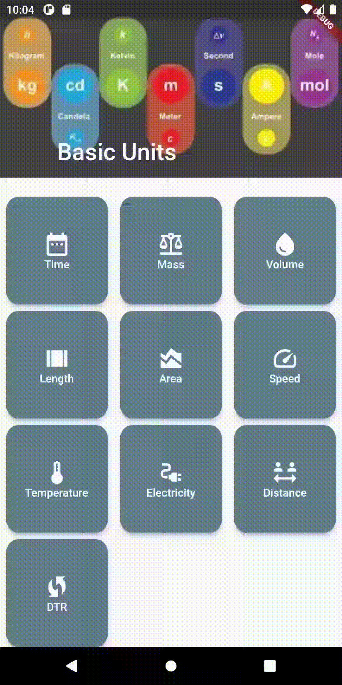

# units_converter

A Flutter app helps Users to convert between the basic units of measurement.

## The Current Added Units(Not supported yet!):
- Time.
- Mass.
- Volume.
- Length.
- Area.
- Speed.
- Temperature.
- Electrical Current.
- Distance.
- DTR(Data transfer Rate).

## Screenshots:

